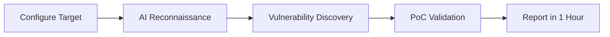

{/* SEO: Primary Keywords - VAPT, vulnerability assessment, penetration testing, AI security, automated pentesting */}
{/* SEO: Secondary Keywords - cyber security, security compliance, SOC 2, ISO 27001, PCI-DSS */}

# Welcome to AIPTx

<Note>
**Get security reports in 1 hour** — AIPTx delivers automated penetration testing with validated findings and proof-of-concept evidence, reducing assessment time from weeks to hours.
</Note>

AIPTx is a cloud-based SaaS platform that automates vulnerability assessment and penetration testing (VAPT). Discover critical vulnerabilities before hackers exploit them with AI-powered security testing that identifies attack chains often missed by manual testing.

## Why AIPTx?

<CardGroup cols={2}>
  <Card title="Results in 1 Hour" icon="clock">
    Get comprehensive security reports in under an hour, not weeks. Continuous monitoring keeps you protected 24/7.
  </Card>
  <Card title="Validated Findings with PoC" icon="check-circle">
    Every vulnerability includes proof-of-concept exploits and evidence, eliminating false positives from your reports.
  </Card>
  <Card title="Attack Chain Detection" icon="link">
    AI identifies complex attack chains and vulnerabilities that manual testing often misses.
  </Card>
  <Card title="Auto-Remediation" icon="wand-magic-sparkles">
    Get production-ready code fixes automatically generated for each vulnerability.
  </Card>
</CardGroup>

## Platform Capabilities

| Capability | Description |
|------------|-------------|
| **Web Application Security** | OWASP Top 10, business logic flaws, authentication bypass |
| **API Security Testing** | REST, GraphQL, and API endpoint vulnerability detection |
| **Cloud Security Assessment** | AWS, Azure, GCP misconfiguration scanning |
| **Attack Surface Monitoring** | Continuous discovery across APIs, web apps, networks, and code repos |
| **CI/CD Integration** | Native GitHub Actions & GitLab CI pipelines |
| **Real-time Alerts** | Slack & Microsoft Teams notifications |

## Compliance & Certifications

AIPTx is trusted by organizations across financial services, tech, and healthcare sectors.

<CardGroup cols={3}>
  <Card title="SOC 2 Type II" icon="shield-check">
    Certified compliant
  </Card>
  <Card title="ISO 27001" icon="globe">
    Certified compliant
  </Card>
  <Card title="PCI DSS" icon="credit-card">
    Compliant reporting
  </Card>
</CardGroup>

## How It Works



1. **Configure your target** — Provide your application URL, API endpoints, or cloud environment
2. **AI reconnaissance** — AIPTx maps your complete attack surface automatically
3. **Vulnerability discovery** — AI agents probe for security weaknesses and attack chains
4. **PoC validation** — Each finding is validated with working proof-of-concept exploits
5. **Get your report** — Receive a compliance-ready report with auto-generated remediation code

## SDKs & Installation

AIPTx is available as a Python package and provides SDKs for multiple languages:

<Tabs>
  <Tab title="Python">
    ```bash
    pip install aiptx
    ```
    Current version: **v2.0.6** (1.17k+ monthly downloads)
  </Tab>
  <Tab title="Node.js">
    ```bash
    npm install @aiptx/sdk
    ```
  </Tab>
  <Tab title="Go">
    ```bash
    go get github.com/aiptx/aiptx-go
    ```
  </Tab>
</Tabs>

## Pricing

AIPTx offers flexible pricing from **$99/month** for startups to **$1,999/month** for enterprise teams, with 5 plans to match your security needs.

<CardGroup cols={2}>
  <Card title="View Pricing" icon="tag" href="https://aiptx.io/pricing">
    Compare all 5 pricing tiers
  </Card>
  <Card title="Start Free Assessment" icon="play" href="https://aiptx.io">
    Try AIPTx with no commitment
  </Card>
</CardGroup>

## Quick Links

<CardGroup cols={3}>
  <Card title="Quick Start" icon="rocket" href="/docs/quickstart">
    Get your first scan running in 5 minutes
  </Card>
  <Card title="CLI Reference" icon="terminal" href="/docs/usage/cli-reference">
    Complete command-line documentation
  </Card>
  <Card title="API Reference" icon="code" href="/api-reference/introduction">
    Integrate AIPTx into your workflows
  </Card>
</CardGroup>

