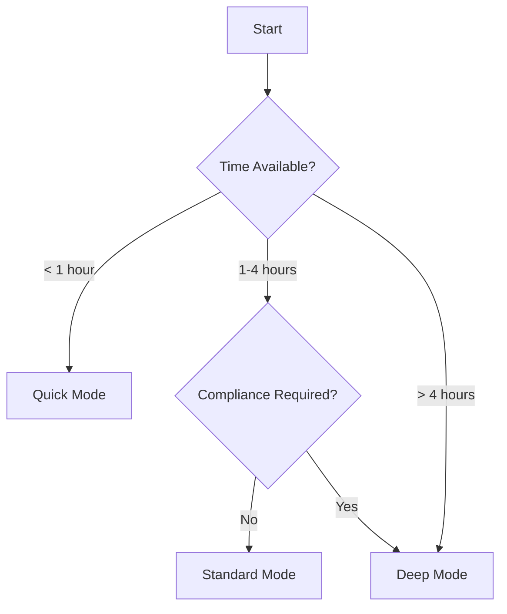

# Scan Modes

AIPTx offers different scan modes optimized for various use cases. Choose the right mode based on your time constraints and depth requirements.

## Available Modes

| Mode | Duration | Coverage | Best For |
|------|----------|----------|----------|
| **Quick** | 15-30 min | Surface-level | Pre-deployment checks, CI/CD |
| **Standard** | 1-4 hours | Comprehensive | Regular security assessments |
| **Deep** | 4-24 hours | Exhaustive | Compliance audits, annual pentests |

## Quick Mode

Quick mode performs a rapid assessment focusing on critical vulnerabilities.

```bash
aiptx scan https://example.com --mode quick
```

### What's Tested

- OWASP Top 10 vulnerabilities
- Known CVEs in detected technologies
- Basic authentication flaws
- Common misconfigurations
- SSL/TLS issues

### When to Use

<CardGroup cols={2}>
  <Card title="CI/CD Pipeline" icon="rotate">
    Run on every pull request to catch obvious issues before merge
  </Card>
  <Card title="Pre-Deployment" icon="rocket">
    Quick sanity check before pushing to production
  </Card>
</CardGroup>

### Limitations

- Does not test complex business logic
- Limited fuzzing iterations
- May miss deeply nested vulnerabilities

## Standard Mode

Standard mode provides comprehensive coverage suitable for most use cases.

```bash
aiptx scan https://example.com --mode standard
```

### What's Tested

Everything in Quick mode, plus:

- Full OWASP testing methodology
- Business logic vulnerabilities
- Authentication and session management
- Access control testing (IDOR, privilege escalation)
- API security testing
- File upload vulnerabilities
- Server-side request forgery (SSRF)

### When to Use

<CardGroup cols={2}>
  <Card title="Regular Assessments" icon="calendar">
    Monthly or quarterly security testing
  </Card>
  <Card title="New Feature Releases" icon="code-branch">
    Before launching significant new functionality
  </Card>
</CardGroup>

### Configuration

```bash
aiptx scan https://example.com \
  --mode standard \
  --type web \
  --auth-type bearer \
  --auth-token "your_token"
```

## Deep Mode

Deep mode performs exhaustive testing suitable for compliance requirements.

```bash
aiptx scan https://example.com --mode deep
```

### What's Tested

Everything in Standard mode, plus:

- Extended fuzzing with thousands of payloads
- Race condition testing
- Complex multi-step attack chains
- Advanced injection techniques
- Cryptographic weakness analysis
- Source code pattern matching (if available)
- Full API endpoint enumeration

### When to Use

<CardGroup cols={2}>
  <Card title="Compliance Audits" icon="file-certificate">
    SOC 2, ISO 27001, PCI-DSS assessments
  </Card>
  <Card title="Annual Pentests" icon="shield">
    Comprehensive yearly security review
  </Card>
</CardGroup>

### Resource Considerations

<Warning>
Deep mode generates significantly more traffic to your target application. Ensure your infrastructure can handle the load, or consider running during off-peak hours.
</Warning>

```bash
# Schedule deep scan for off-peak hours
aiptx scan https://example.com \
  --mode deep \
  --schedule "2024-01-15T02:00:00Z"
```

## Scan Types

In addition to modes, you can specify the type of scan:

### Web Application Scan

```bash
aiptx scan https://example.com --type web
```

Tests browser-based applications including:
- Frontend vulnerabilities (XSS, DOM manipulation)
- Form submissions
- Client-side validation bypass
- Cookie security

### API Scan

```bash
aiptx scan https://api.example.com --type api --openapi ./spec.yaml
```

Tests API endpoints including:
- REST, GraphQL, gRPC protocols
- Input validation
- Authentication/Authorization
- Rate limiting
- Data exposure

### Network Scan

```bash
aiptx scan 192.168.1.0/24 --type network
```

Tests network infrastructure including:
- Open ports and services
- Service version vulnerabilities
- Network misconfigurations
- Internal service exposure

### Full Scan

```bash
aiptx scan https://example.com --type full
```

Combines web, API, and network scanning for complete coverage.

## Comparison Matrix

| Feature | Quick | Standard | Deep |
|---------|-------|----------|------|
| OWASP Top 10 | Full | Full | Full |
| Business Logic | Basic | Full | Exhaustive |
| Authentication Testing | Basic | Full | Advanced |
| Fuzzing Iterations | 100 | 1,000 | 10,000+ |
| Race Conditions | No | Basic | Full |
| Attack Chains | No | Basic | Advanced |
| Compliance Reports | Basic | Full | Full |
| Estimated Duration | 15-30m | 1-4h | 4-24h |

## Choosing the Right Mode



<Tip>
Start with Standard mode for your first scan to establish a baseline, then use Quick mode for ongoing CI/CD integration and Deep mode for periodic comprehensive assessments.
</Tip>
