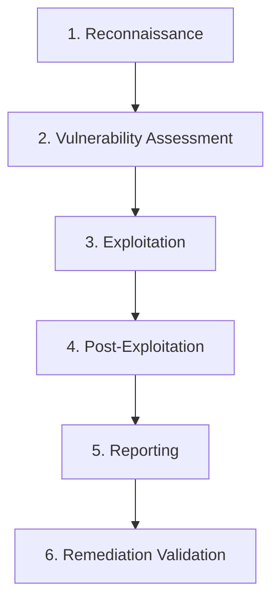

{/* SEO: Primary Keywords - VAPT services, vulnerability assessment, penetration testing, security testing services */}
{/* SEO: Secondary Keywords - pentest services, security audit, cyber security services, compliance testing */}

# VAPT Services

<Note>
**Reports in 1 hour, not weeks** — AIPTx delivers automated penetration testing with validated findings and proof-of-concept evidence, with pricing starting at just **$99/month**.
</Note>

AIPTx provides enterprise-grade **Vulnerability Assessment and Penetration Testing (VAPT)** services powered by advanced AI technology. Our cloud-based SaaS platform delivers the expertise of seasoned penetration testers at scale, with results in under an hour.

## What is VAPT?

**VAPT (Vulnerability Assessment and Penetration Testing)** is a comprehensive security testing methodology that combines:

<CardGroup cols={2}>
  <Card title="Vulnerability Assessment (VA)" icon="magnifying-glass">
    Systematic identification and classification of security weaknesses in your systems, networks, and applications.
  </Card>
  <Card title="Penetration Testing (PT)" icon="crosshairs">
    Active exploitation attempts to validate vulnerabilities and demonstrate real-world attack impact.
  </Card>
</CardGroup>

## Why Choose AIPTx for VAPT?

### AI-Powered Automation

Unlike traditional manual penetration testing, AIPTx uses advanced AI that delivers results in **1 hour**:

- **Results in 1 hour** — Get comprehensive security reports in under an hour, not weeks
- **Attack chain detection** — Identifies complex attack chains often missed by manual testing
- **Validated findings with PoC** — Every vulnerability includes proof-of-concept exploits
- **Auto-remediation** — Production-ready code fixes generated automatically
- **24/7 continuous monitoring** — Real-time alerts via Slack & Microsoft Teams
- **Expert access** — Direct access to certified pentesters for complex findings

### Comprehensive Security Coverage

| Security Domain | Testing Capabilities |
|-----------------|---------------------|
| **Web Applications** | OWASP Top 10, business logic, authentication, session management |
| **APIs** | REST, GraphQL, gRPC, OpenAPI/Swagger, OWASP API Top 10 |
| **Mobile Apps** | iOS, Android, API backends, data storage |
| **Networks** | Infrastructure, services, configurations, CVE detection |
| **Cloud** | AWS, Azure, GCP misconfigurations, IAM, storage exposure |

## Pricing & Plans

AIPTx offers **5 flexible pricing tiers** from $99 to $1,999/month:

<CardGroup cols={3}>
  <Card title="Starter" icon="seedling">
    **$99/month**
    - Web application testing
    - OWASP Top 10 coverage
    - Monthly automated scans
    - PDF reports
  </Card>
  <Card title="Professional" icon="shield-halved">
    **Mid-tier pricing**
    - Web + API testing
    - Full vulnerability coverage
    - Weekly automated scans
    - CI/CD integration (GitHub/GitLab)
    - SOC 2 & ISO 27001 reports
  </Card>
  <Card title="Enterprise" icon="building">
    **Up to $1,999/month**
    - Full-stack security testing
    - Cloud security assessment
    - Continuous 24/7 monitoring
    - Slack/Teams alerts
    - Dedicated pentester access
  </Card>
</CardGroup>

<Card title="View All 5 Plans" icon="tag" href="https://aiptx.io/pricing">
  Compare features and find the right plan for your security needs
</Card>

## Compliance-Ready VAPT Reports

AIPTx generates audit-ready reports mapped to major compliance frameworks:

### Supported Compliance Frameworks

| Framework | Use Case | Report Type |
|-----------|----------|-------------|
| **SOC 2** | SaaS, Service Providers | Trust Service Criteria mapping |
| **ISO 27001** | International Standard | Annex A control assessment |
| **PCI-DSS** | Payment Processing | Requirement 6 & 11 validation |
| **HIPAA** | Healthcare | Security Rule assessment |
| **GDPR** | EU Data Protection | Article 32 compliance |
| **NIST CSF** | Government, Enterprise | Framework function mapping |
| **OWASP ASVS** | Application Security | Verification level assessment |

### Sample Compliance Report

```
═══════════════════════════════════════════════════════════════
AIPTx VAPT Compliance Report - SOC 2 Type II
═══════════════════════════════════════════════════════════════

Executive Summary
─────────────────────────────────────────────────────────────
Scan Date: January 2025
Target: https://app.example.com
Compliance Score: 94%
Critical Findings: 0
High Findings: 2

Trust Service Criteria Assessment
─────────────────────────────────────────────────────────────
CC6.1 - Logical Access Security     ✅ Compliant
CC6.2 - User Access Management      ✅ Compliant
CC6.3 - User Authentication         ⚠️ Minor gaps (MFA coverage)
CC6.6 - Encryption Controls         ✅ Compliant
CC6.7 - Vulnerability Management    ✅ Compliant

Detailed Findings: See Appendix A
Remediation Roadmap: See Appendix B
Evidence Package: Attached
═══════════════════════════════════════════════════════════════
```

## VAPT Methodology

AIPTx follows industry-standard penetration testing methodologies:



### Phase Details

1. **Reconnaissance & Discovery**
   - Attack surface mapping
   - Technology fingerprinting
   - Endpoint enumeration
   - Authentication flow analysis

2. **Vulnerability Assessment**
   - Automated vulnerability scanning
   - Configuration analysis
   - Code pattern detection
   - Dependency vulnerability check

3. **Exploitation & Validation**
   - Proof-of-concept development
   - Impact demonstration
   - False positive elimination
   - Attack chain identification

4. **Post-Exploitation Analysis**
   - Privilege escalation testing
   - Lateral movement simulation
   - Data access assessment
   - Persistence mechanism testing

5. **Comprehensive Reporting**
   - Executive summary
   - Technical findings
   - Risk prioritization (CVSS 3.1)
   - Remediation guidance
   - Compliance mapping

6. **Remediation Validation**
   - Fix verification
   - Regression testing
   - Compliance re-assessment

## Industry-Specific VAPT

### Financial Services VAPT

- PCI-DSS compliance testing
- Transaction security validation
- API security for fintech
- Mobile banking security

### Healthcare VAPT

- HIPAA security assessment
- PHI/ePHI protection testing
- Medical device security
- Telehealth platform testing

### SaaS & Technology VAPT

- SOC 2 compliance validation
- Multi-tenant security testing
- API and integration security
- CI/CD pipeline security

### E-commerce VAPT

- Payment flow security
- Customer data protection
- Session management testing
- Business logic validation

## Continuous VAPT vs Point-in-Time Testing

| Aspect | Traditional Pentest | AIPTx Continuous VAPT |
|--------|--------------------|-----------------------|
| **Frequency** | Annual or quarterly | Continuous (24/7) |
| **Coverage** | Sample-based | Comprehensive |
| **Speed** | Weeks | Hours |
| **Cost** | High per engagement | Predictable subscription |
| **Scalability** | Limited | Unlimited |
| **CI/CD Integration** | Manual | Automated |
| **Compliance** | Point-in-time | Continuous assurance |

## Get Started with VAPT

<CardGroup cols={2}>
  <Card title="Start Free Trial" icon="play" href="https://aiptx.io/signup">
    Run your first VAPT scan free. No credit card required.
  </Card>
  <Card title="Talk to Security Expert" icon="headset" href="https://aiptx.io/contact">
    Discuss your security requirements with our team.
  </Card>
  <Card title="View Pricing" icon="tag" href="https://aiptx.io/pricing">
    Flexible plans for startups to enterprises.
  </Card>
  <Card title="Read Documentation" icon="book" href="/docs/introduction">
    Technical documentation and integration guides.
  </Card>
</CardGroup>

## Frequently Asked Questions

<AccordionGroup>
  <Accordion title="What is the difference between VA and PT?">
    **Vulnerability Assessment (VA)** identifies and classifies security weaknesses through automated scanning. **Penetration Testing (PT)** goes further by actively exploiting vulnerabilities to demonstrate real-world impact. AIPTx combines both in a comprehensive VAPT approach.
  </Accordion>

  <Accordion title="How often should I perform VAPT?">
    For compliance and best practices, organizations should perform VAPT:
    - **Continuously** for production applications (AIPTx automated)
    - **After major releases** via CI/CD integration
    - **Quarterly** for compliance requirements (SOC 2, PCI-DSS)
    - **Annually** for comprehensive manual review
  </Accordion>

  <Accordion title="Is AIPTx VAPT accepted for compliance audits?">
    Yes. AIPTx generates audit-ready reports with evidence packages that satisfy requirements for SOC 2, ISO 27001, PCI-DSS, HIPAA, GDPR, and other frameworks. Our reports are accepted by major audit firms.
  </Accordion>

  <Accordion title="Can AIPTx test authenticated applications?">
    Yes. AIPTx supports complex authentication scenarios including:
    - Session-based authentication
    - JWT/Bearer tokens
    - OAuth 2.0 flows
    - Multi-factor authentication
    - Custom authentication schemes
  </Accordion>

  <Accordion title="How does AIPTx compare to manual penetration testing?">
    AIPTx complements manual pentesting by providing continuous, scalable coverage. While manual testing is valuable for complex business logic and novel attack vectors, AIPTx automates 90%+ of standard security testing, allowing human experts to focus on high-value assessments.
  </Accordion>
</AccordionGroup>

---

## Related Resources

- [Vulnerability Coverage](/docs/vulnerabilities/overview) - Complete list of detected vulnerabilities
- [Compliance Frameworks](/docs/reports/compliance-frameworks) - Detailed compliance mapping
- [API Documentation](/api-reference/introduction) - Integrate VAPT into your workflow
- [Quick Start Guide](/docs/quickstart) - Run your first scan in 5 minutes
