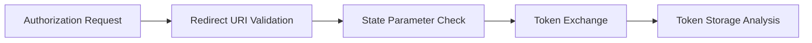

# Authentication Vulnerabilities

AIPTx thoroughly tests authentication mechanisms and session management to identify weaknesses that could lead to unauthorized access.

## Authentication Testing

### Broken Authentication

| Vulnerability | Risk | AIPTx Detection |
|---------------|------|-----------------|
| Credential stuffing | High | Rate limit testing |
| Brute force | High | Account lockout analysis |
| Default credentials | Critical | Common credential testing |
| Weak passwords | Medium | Policy enforcement testing |
| Password reset flaws | High | Token analysis, workflow testing |

### Credential Testing

AIPTx tests for:

- **Default Credentials** - Common username/password combinations
- **Weak Passwords** - Policy enforcement verification
- **Password Recovery** - Secure reset flow validation
- **Account Enumeration** - Response differentiation analysis

### Example Finding

```json
{
  "title": "Account Enumeration via Login Response",
  "severity": "medium",
  "endpoint": "POST /api/auth/login",
  "description": "Different error messages reveal valid usernames",
  "poc": {
    "valid_user": {"response": "Invalid password", "status": 401},
    "invalid_user": {"response": "User not found", "status": 404}
  },
  "remediation": "Use generic error message: 'Invalid credentials'"
}
```

## Session Management

### Session Vulnerabilities

<CardGroup cols={2}>
  <Card title="Session Fixation" icon="thumbtack">
    Tests if session IDs are regenerated after authentication
  </Card>
  <Card title="Session Hijacking" icon="user-secret">
    Validates session token security and transmission
  </Card>
  <Card title="Session Timeout" icon="clock">
    Verifies proper session expiration
  </Card>
  <Card title="Concurrent Sessions" icon="users">
    Tests session management across multiple logins
  </Card>
</CardGroup>

### Session Token Analysis

AIPTx analyzes session tokens for:

```
Token Entropy: 256 bits ✅
Predictability: None detected ✅
Secure Flag: Present ✅
HttpOnly Flag: Present ✅
SameSite: Strict ✅
Expiration: 24 hours ✅
```

### Cookie Security

| Attribute | Purpose | AIPTx Check |
|-----------|---------|-------------|
| `Secure` | HTTPS only | ✅ |
| `HttpOnly` | No JavaScript access | ✅ |
| `SameSite` | CSRF protection | ✅ |
| `Path` | Cookie scope | ✅ |
| `Domain` | Domain scope | ✅ |

## JWT Security

### JWT Vulnerabilities

| Vulnerability | Description | CVSS |
|---------------|-------------|------|
| Algorithm confusion | None algorithm attack | 9.8 |
| Weak signing key | Brute-forceable secrets | 9.1 |
| Missing expiration | Tokens never expire | 7.5 |
| Sensitive data in payload | PII in token | 5.3 |

### Testing Methodology

1. **Algorithm Analysis**
   ```json
   // Algorithm None attack
   {
     "alg": "none",
     "typ": "JWT"
   }
   ```

2. **Key Brute Force**
   - Common secrets testing
   - Dictionary attack on HS256

3. **Claim Manipulation**
   ```json
   {
     "sub": "admin",
     "role": "administrator",
     "exp": 9999999999
   }
   ```

### Example Finding

```json
{
  "title": "JWT Algorithm Confusion Vulnerability",
  "severity": "critical",
  "description": "Server accepts tokens with 'none' algorithm",
  "poc": {
    "original_token": "eyJ0eXAiOiJKV1QiLCJhbGciOiJIUzI1NiJ9...",
    "exploit_token": "eyJ0eXAiOiJKV1QiLCJhbGciOiJub25lIn0.eyJzdWIiOiJhZG1pbiJ9.",
    "result": "Admin access granted without valid signature"
  }
}
```

## OAuth/OIDC Testing

### OAuth Vulnerabilities

- **Open Redirect** - Redirect URI validation bypass
- **CSRF** - State parameter missing or weak
- **Token Leakage** - Tokens in URLs or logs
- **Scope Escalation** - Requesting unauthorized scopes

### Testing Flow



## Multi-Factor Authentication

### MFA Bypass Testing

| Attack | Description | Test |
|--------|-------------|------|
| Code brute force | Rate limit on 2FA codes | ✅ |
| Code reuse | Same code multiple uses | ✅ |
| Backup code abuse | Predictable backup codes | ✅ |
| Session after 2FA | Auth without completing 2FA | ✅ |
| Device trust bypass | Remember device manipulation | ✅ |

### Example Finding

```json
{
  "title": "MFA Bypass via Direct API Access",
  "severity": "critical",
  "description": "API endpoints accessible without completing MFA",
  "poc": {
    "step1": "Complete username/password auth",
    "step2": "Skip MFA prompt, call /api/user directly",
    "result": "User data returned without MFA verification"
  }
}
```

## Password Reset Flaws

### Vulnerabilities Tested

1. **Token Predictability** - Weak random generation
2. **Token Expiration** - Long-lived or no expiration
3. **Token Reuse** - Single-use enforcement
4. **Account Takeover** - Host header injection
5. **Rate Limiting** - Brute force protection

### Host Header Attack

```http
POST /api/password-reset HTTP/1.1
Host: evil.com
Content-Type: application/json

{"email": "victim@example.com"}
```

**Vulnerable Response:**
```
Reset link: https://evil.com/reset?token=abc123
```

## Remediation Guidelines

<AccordionGroup>
  <Accordion title="Secure Session Management">
    ```javascript
    // Session configuration
    app.use(session({
      secret: process.env.SESSION_SECRET,
      resave: false,
      saveUninitialized: false,
      cookie: {
        secure: true,
        httpOnly: true,
        sameSite: 'strict',
        maxAge: 3600000 // 1 hour
      }
    }));

    // Regenerate session on login
    req.session.regenerate((err) => {
      req.session.user = user;
    });
    ```
  </Accordion>

  <Accordion title="Secure JWT Implementation">
    ```javascript
    // Use strong algorithm
    const token = jwt.sign(
      { sub: user.id, role: user.role },
      process.env.JWT_SECRET,
      {
        algorithm: 'RS256',
        expiresIn: '1h',
        issuer: 'your-app'
      }
    );

    // Verify with explicit algorithm
    jwt.verify(token, publicKey, {
      algorithms: ['RS256'],
      issuer: 'your-app'
    });
    ```
  </Accordion>

  <Accordion title="Secure Password Reset">
    ```javascript
    // Generate secure token
    const token = crypto.randomBytes(32).toString('hex');

    // Store with expiration
    await db.passwordResets.create({
      userId: user.id,
      token: hashToken(token),
      expiresAt: Date.now() + 3600000 // 1 hour
    });

    // Use internal URL for reset link
    const resetUrl = `${process.env.APP_URL}/reset?token=${token}`;
    ```
  </Accordion>
</AccordionGroup>
