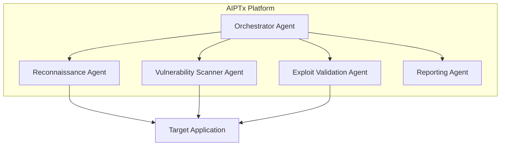

# How AIPTx Works

AIPTx uses autonomous AI agents that replicate the methodology of expert penetration testers. Here's a deep dive into how the platform operates.

## The AIPTx Architecture



## Phase 1: Reconnaissance

The reconnaissance agent maps your application's attack surface:

- **Endpoint Discovery** - Crawls and identifies all accessible endpoints
- **Technology Fingerprinting** - Detects frameworks, libraries, and versions
- **Authentication Flows** - Maps login, registration, and session management
- **API Schema Analysis** - Parses OpenAPI/Swagger specs for comprehensive coverage
- **Asset Discovery** - Finds subdomains, related services, and shadow IT

```
Reconnaissance Results:
├── Endpoints: 156 discovered
├── Technologies: React, Node.js, PostgreSQL
├── Auth Methods: JWT, OAuth 2.0
├── API Version: v2 (OpenAPI 3.0)
└── Subdomains: 3 found (api, staging, admin)
```

## Phase 2: Vulnerability Discovery

AI agents systematically test for vulnerabilities using intelligent fuzzing and attack patterns:

### Injection Testing
- SQL, NoSQL, Command, LDAP injection
- Template injection (SSTI)
- Header injection

### Authentication & Session
- Brute force protection
- Session fixation
- Token security
- Password reset flaws

### Access Control
- IDOR (Insecure Direct Object References)
- Privilege escalation
- Horizontal/vertical access control bypass

### Business Logic
- Price manipulation
- Workflow bypass
- Race conditions
- Rate limiting bypass

## Phase 3: Exploit Validation

Unlike traditional scanners, AIPTx validates every finding:

#### What makes validation different?

Traditional scanners often report theoretical vulnerabilities based on patterns. AIPTx actually exploits the vulnerability to prove it's real:

**Traditional Scanner Output:**
```
Possible SQL Injection at /api/search (Medium Confidence)
```

**AIPTx Output:**
```
Confirmed SQL Injection at /api/search
PoC: POST /api/search {"query": "' UNION SELECT username, password FROM users--"}
Result: Retrieved 1,247 user credentials
Impact: Full database access
```


### Proof-of-Concept Generation

Every validated finding includes:

1. **Exact Request** - Copy-paste ready HTTP request
2. **Response Evidence** - Proof the exploit worked
3. **Impact Assessment** - What an attacker could achieve
4. **CVSS Score** - Standardized severity rating

## Phase 4: Intelligent Prioritization

AIPTx doesn't just find vulnerabilities - it helps you prioritize:

| Factor | Weight | Description |
|--------|--------|-------------|
| **Exploitability** | 40% | How easy is it to exploit? |
| **Impact** | 30% | What's the potential damage? |
| **Asset Value** | 20% | Is this a critical system? |
| **Exposure** | 10% | Is it internet-facing? |

## Phase 5: Reporting

Generate compliance-ready reports with:

- Executive summary for stakeholders
- Technical details for developers
- Remediation guidance with code examples
- Compliance mapping (SOC 2, ISO 27001, PCI-DSS)
- Trend analysis and risk scoring

## AI Agent Capabilities

AIPTx agents have access to a full security toolkit:


  ### Browser Automation

    Headless browser for testing JavaScript-heavy applications and complex workflows
  
  ### HTTP Proxy

    Intercepts and modifies traffic for authentication bypass and session testing
  
  ### Dynamic Analysis

    Executes payloads and analyzes responses in real-time
  
  ### API Testing

    Native support for REST, GraphQL, gRPC, and WebSocket APIs
  


## Security & Privacy

> **Warning:**
>
  AIPTx is designed with security-first principles:

  - All scan data is encrypted at rest and in transit
  - Findings are never shared or used for training
  - SOC 2 Type II certified infrastructure
  - Option for on-premise deployment (Enterprise)


## Next Steps

### Run Your First Scan

  Ready to get started? Follow our quick start guide.

