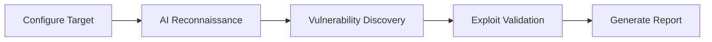

# Welcome to AIPTx

AIPTx is an autonomous AI-powered penetration testing platform that acts like an expert security researcher. It dynamically scans your applications, finds vulnerabilities, and validates them with proof-of-concept exploits.

## What is AIPTx?

AIPTx combines advanced AI agents with professional penetration testing methodologies to deliver:

  ### Autonomous Testing

    AI agents that think and act like experienced penetration testers, exploring your application for vulnerabilities.
  
  ### Real Validation

    Every finding includes a working proof-of-concept, eliminating false positives from your reports.
  
  ### Compliance Ready

    Generate audit-ready reports for SOC 2, ISO 27001, PCI-DSS, HIPAA, and 40+ compliance frameworks.
  
  ### Developer Friendly

    Integrates with your CI/CD pipeline, GitHub/GitLab, Slack, and Jira for seamless DevSecOps workflows.
  

## Vulnerability Coverage

AIPTx tests for a comprehensive range of vulnerabilities across multiple categories:

| Category | Examples |
|----------|----------|
| **Injection** | SQL Injection, Command Injection, LDAP Injection, XPath Injection |
| **Authentication** | Broken Authentication, Session Management, Credential Stuffing |
| **Access Control** | IDOR, Privilege Escalation, Forced Browsing, Path Traversal |
| **Business Logic** | Price Manipulation, Workflow Bypass, Race Conditions |
| **Client-Side** | XSS (Stored, Reflected, DOM), CSRF, Clickjacking |
| **Server-Side** | SSRF, XXE, Insecure Deserialization, File Upload |

## How It Works

1. **Configure your target** - Provide your application URL, API endpoints, or network range
2. **AI reconnaissance** - AIPTx maps your attack surface and identifies entry points
3. **Vulnerability discovery** - AI agents probe for security weaknesses
4. **Exploit validation** - Each finding is validated with a working proof-of-concept
5. **Generate report** - Receive a compliance-ready report with remediation guidance

## Quick Links

  ### Quick Start

    Get your first scan running in 5 minutes
  
  ### CLI Reference

    Complete command-line documentation
  
  ### API Reference

    Integrate AIPTx into your workflows
  

